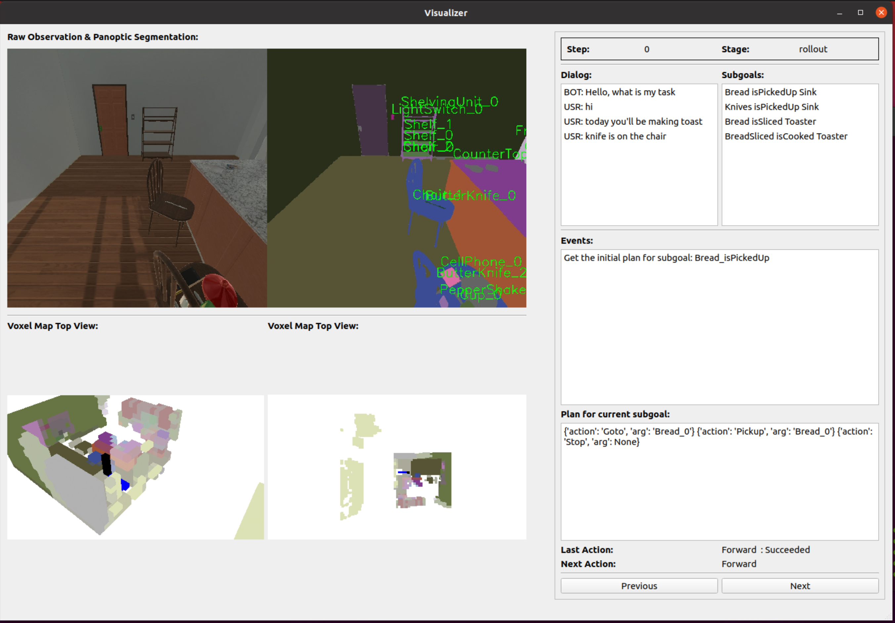

# DANLI Visualizer

This visualizer is developed to analyze the behavior of our deliberative agent for the DANLI project.

Create a conda environment and install the necessary packages:
```
conda create -n danli_visualizer 
pip install -r requirements.txt
```
Then activate the environment and run the main program:
```
conda activate danli_visualizer
python main.py
```

